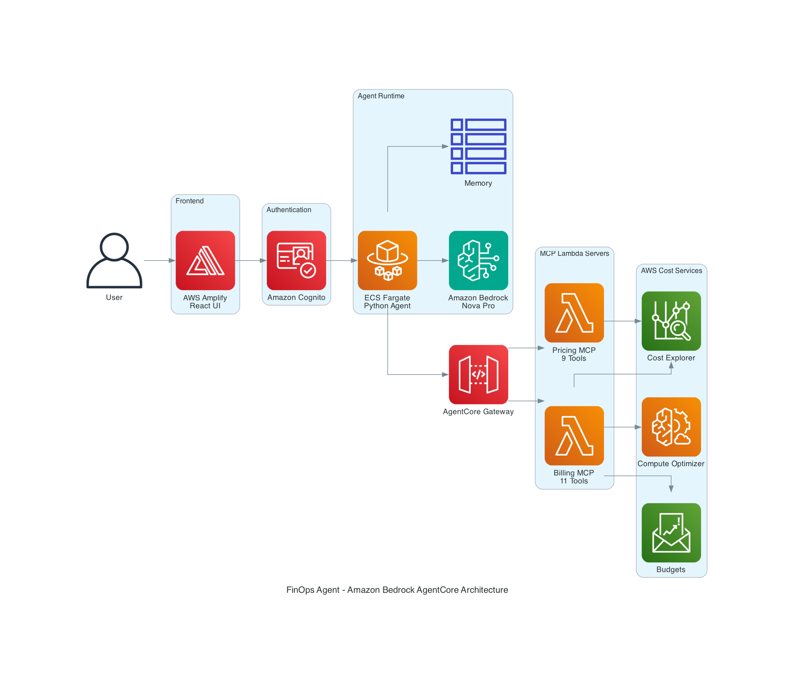

# Build a FinOps agent using Amazon Bedrock AgentCore with Gateway, Runtime, and Amazon Nova

Managing AWS costs effectively requires continuous monitoring, analysis, and optimization across multiple services and accounts. Finance teams and cloud administrators need tools that can quickly analyze spending patterns, identify optimization opportunities, and provide actionable recommendations without requiring deep knowledge of AWS APIs or console navigation.

Amazon Bedrock AgentCore provides a production-ready platform for building AI agents with advanced capabilities including conversational memory, tool orchestration through gateways, and scalable runtime environments. Combined with Amazon Nova foundation models, AgentCore supports building intelligent assistants that can interact naturally with users while accessing specialized tools and maintaining conversation context.

Amazon Nova is AWS's next-generation foundation model family, offering three model types optimized for different use cases:

- **Amazon Nova Micro** - Text-only model optimized for speed and cost-effectiveness
- **Amazon Nova Lite** - Multimodal model balancing speed and accuracy
- **Amazon Nova Pro** - Highly capable multimodal model for complex reasoning tasks

These models excel at complex reasoning, long-context understanding (up to 300K tokens), multilingual support, tool use, and conversational memory. Amazon Nova provides industry-leading price-performance, making it well-suited for enterprise applications like cost management.

In this post, we demonstrate how to build a FinOps agent using Amazon Bedrock AgentCore, Amazon Nova Pro, the Strands agent framework, and the Model Context Protocol (MCP). This solution shows how AI agents can help organizations analyze, optimize, and manage AWS costs through natural conversation.

## Solution overview

This AWS cost management solution combines AI with AgentCore's production architecture to provide cost analysis and optimization recommendations. The system consists of four main components:

**Amazon Bedrock AgentCore Runtime** - Containerized, scalable runtime environment hosting the AI agent with built-in conversational memory, tool orchestration, and production-grade reliability.

**AgentCore Gateway** - Routing layer managing tool invocations, authentication, and unified access to backend services through MCP servers.

**MCP Lambda Servers** - Specialized Lambda functions implementing the Model Context Protocol, providing 20 tools for cost analysis (11 tools) and pricing information (9 tools).

**Strands Agent Framework** - Python framework for building AI agents with native support for tool use, memory management, and streaming responses.

The solution integrates Amazon Bedrock AgentCore with Amazon Nova Pro to create an interactive cost management assistant. Key features include:

**Conversational Memory** - 30-day retention of conversation history supports context-aware interactions where the agent remembers previous questions and builds on earlier discussions.

**20 Specialized Tools** - Complete coverage of AWS cost management through dedicated tools for cost analysis, forecasting, optimization recommendations, budget tracking, and pricing comparisons.

**Production-Ready Architecture** - Containerized runtime with auto-scaling, IAM-based security, and CloudWatch integration for monitoring and logging.

**Natural Language Interface** - Users ask questions in plain English and receive detailed, actionable insights without needing AWS API knowledge or console navigation.

**Real-Time Cost Analysis** - Direct integration with AWS Cost Explorer, Budgets, Compute Optimizer, and Pricing APIs for current information.

This solution helps finance teams and cloud administrators gain insights into AWS spending patterns and identify cost-saving opportunities through a conversational interface.

The following diagram shows the architecture using AWS Lambda functions, Amazon Bedrock AgentCore Runtime, and AgentCore Gateway to create a scalable, secure system for cloud financial management.



**Architecture Flow:**

1. **User Interface** - Users interact through an AWS Amplify-hosted React application
2. **Authentication** - Amazon Cognito provides secure user authentication and authorization
3. **Agent Runtime** - ECS Fargate hosts the Python agent with Strands SDK, integrating with Amazon Bedrock Nova Pro for AI capabilities and maintaining conversation memory in DynamoDB
4. **Gateway** - AgentCore Gateway routes tool requests to appropriate MCP Lambda servers using IAM authentication
5. **MCP Servers** - Two specialized Lambda functions provide 20 tools:
   - **Billing MCP** (11 tools) - Cost analysis, budgets, anomalies, and optimization recommendations
   - **Pricing MCP** (9 tools) - Service pricing, instance comparisons, and rate information
6. **AWS Services** - Direct integration with Cost Explorer, Budgets, Compute Optimizer, and Pricing APIs for real-time data

In the following sections, we explore the architecture of our solution, examine the capabilities of each component, and discuss how this approach can improve AWS cost management strategies.

## Prerequisites

You must have the following in place to complete the solution in this post:

- An active AWS account
- AWS CLI installed and configured
- Node.js (v18 or later) and npm installed
- Python 3.13 installed
- AWS CDK installed (`npm install -g aws-cdk`)
- Docker installed (for local testing, optional)
- Access to Amazon Bedrock with Amazon Nova Pro model enabled in us-east-1
- IAM permissions to create:
  - Amazon Bedrock AgentCore resources (Runtime, Gateway, Memory)
  - Amazon ECR repositories
  - AWS Lambda functions
  - Amazon Cognito User Pools and Identity Pools
  - IAM roles and policies
  - Amazon ECS tasks and services
  - AWS CodeBuild projects

## Deploy solution resources using AWS CDK

This solution is designed to run in the us-east-1 Region. The deployment uses AWS CDK to provision all necessary infrastructure through three CloudFormation stacks.

### Architecture components deployed

**Image Stack** - Creates an Amazon ECR repository and AWS CodeBuild project to build the ARM64 container image for the AgentCore Runtime.

**Agent Stack** - Deploys the core AgentCore components:
- AgentCore Runtime (containerized Python agent)
- AgentCore Gateway (tool routing layer)
- AgentCore Memory (30-day conversation retention)
- Two Lambda functions (Billing MCP Server and Pricing MCP Server)
- IAM roles with appropriate permissions

**Auth Stack** - Sets up Amazon Cognito authentication:
- User Pool for user management
- Identity Pool for AWS credential federation
- IAM roles for authenticated users
- Admin user with temporary password

### Deployment steps

**Step 1: Clone the repository**

```bash
git clone <repository-url>
cd finops-agent-cdk
```

**Step 2: Set environment variables**

```bash
export ADMIN_EMAIL="your-email@example.com"
export AWS_REGION="us-east-1"
```

**Step 3: Deploy using the deployment script**

```bash
chmod +x deploy.sh
./deploy.sh
```

The deployment script will:
1. Install CDK dependencies
2. Build TypeScript code
3. Bootstrap CDK (if needed)
4. Deploy ImageStack (creates ECR and builds container)
5. Deploy AgentStack (creates Runtime, Gateway, Memory, Lambdas)
6. Deploy AuthStack (creates Cognito resources)

The deployment takes approximately 15-20 minutes. After completion, note the following outputs from the CloudFormation console:

**From AgentStack outputs:**
- `RuntimeArn` - Amazon Bedrock AgentCore Runtime ARN
- `GatewayArn` - AgentCore Gateway ARN
- `MemoryId` - AgentCore Memory ID

**From AuthStack outputs:**
- `UserPoolId` - Cognito User Pool ID
- `UserPoolClientId` - Cognito App Client ID
- `IdentityPoolId` - Cognito Identity Pool ID
- `AdminUsername` - Admin user name (default: admin)

You will receive an email with a temporary password for the admin user.

## Deploy the Amplify application

You need to manually deploy the Amplify application using the frontend code found on GitHub. Complete the following steps:

1. Download the frontend code from the GitHub repository
2. Navigate to AWS Amplify in the AWS Management Console
3. Choose "Deploy without Git provider"
4. Upload the application .zip file
5. Wait for the deployment to complete
6. Note the Amplify-generated domain URL

## Amazon Cognito for user authentication

The FinOps application uses Amazon Cognito user pools and identity pools to implement secure, role-based access control for finance team members. User pools handle authentication and group management, and identity pools provide temporary AWS credentials mapped to specific IAM roles. The system ensures that only verified finance team members can access the application and interact with the Amazon Bedrock AgentCore Runtime, combining security with a streamlined user experience.

## Amazon Bedrock AgentCore architecture

The Amazon Bedrock AgentCore architecture represents a modern approach to building production-ready AI agents with enterprise-grade capabilities.

### AgentCore Runtime

The Runtime is a containerized environment hosted on Amazon ECS that runs your AI agent code. Key features include:

**Strands Agent Framework** - A Python framework that provides a clean, intuitive API for building agents with tool use, memory management, and streaming responses.

**MCP Client Integration** - Built-in support for the Model Context Protocol provides direct communication with backend services through the Gateway.

**Conversational Memory** - Integration with AgentCore Memory service provides automatic conversation history management with configurable retention periods.

**Production-Ready** - Auto-scaling, health checks, CloudWatch logging, and IAM-based security out of the box.

The Runtime code uses the Strands framework to create an agent with Amazon Nova Pro:

```python
from strands import Agent
from strands.models import BedrockModel
from bedrock_agentcore.memory.integrations.strands import AgentCoreMemorySessionManager

# Create agent with memory
session_manager = AgentCoreMemorySessionManager(
    agentcore_memory_config=memory_config,
    region_name=AWS_REGION
)

agent = Agent(
    model=BedrockModel(model_id='us.amazon.nova-pro-v1:0'),
    tools=mcp_tools,
    session_manager=session_manager
)
```

### AgentCore Gateway

The Gateway acts as an intelligent routing layer between the Runtime and backend services. It provides:

**Tool Schema Management** - Centralized definition of all 20 tools with input schemas, descriptions, and validation rules.

**IAM Authentication** - Secure, credential-based authentication using AWS SigV4 signing.

**Lambda Target Routing** - Routes tool invocations to the appropriate Lambda function based on tool name.

**Credential Management** - Handles AWS credential propagation to Lambda functions.

The Gateway is configured with two Lambda targets:

```typescript
gateway.addLambdaTarget('BillingTarget', {
  gatewayTargetName: 'billing',
  lambdaFunction: billingLambda,
  toolSchema: agentcore.ToolSchema.fromInline([
    // 11 billing tools defined here
  ]),
  credentialProviderConfigurations: [
    agentcore.GatewayCredentialProvider.fromIamRole(),
  ],
});

gateway.addLambdaTarget('PricingTarget', {
  gatewayTargetName: 'pricing',
  lambdaFunction: pricingLambda,
  toolSchema: agentcore.ToolSchema.fromInline([
    // 9 pricing tools defined here
  ]),
  credentialProviderConfigurations: [
    agentcore.GatewayCredentialProvider.fromIamRole(),
  ],
});
```

### AgentCore Memory

AgentCore Memory provides managed conversation history storage with:

**30-Day Retention** - Configurable retention period for conversation history.

**Per-Session Storage** - Separate conversation threads for different users and sessions.

**Automatic Management** - The Strands session manager handles retrieval and storage automatically.

**Efficient Context** - Only relevant conversation history is included in each request, preventing token limit issues.

## Lambda functions for MCP servers

The solution uses two Lambda functions implementing the Model Context Protocol (MCP) to provide specialized tools.

### Billing MCP Lambda (11 tools)

This Lambda function provides comprehensive cost analysis capabilities:

**Cost Analysis Tools:**
- `get_cost_and_usage` - Historical cost data with flexible grouping (region, account, instance type, etc.)
- `get_cost_by_service` - Service-level cost breakdown
- `get_cost_by_usage_type` - Usage type breakdown (BoxUsage, DataTransfer, etc.)
- `get_cost_forecast` - Future cost predictions
- `get_cost_anomalies` - Unusual spending pattern detection

**Budget Management:**
- `get_budgets` - List all budgets and their status
- `get_budget_details` - Detailed budget information

**Optimization Tools:**
- `get_free_tier_usage` - Free tier tracking
- `get_rightsizing_recommendations` - EC2 rightsizing opportunities
- `get_savings_plans_recommendations` - Savings Plans purchase advice
- `get_compute_optimizer_recommendations` - Multi-resource optimization (EC2, EBS, Lambda)

Each tool is designed with a unique signature to ensure proper detection and routing:

```python
def handler(event, context):
    # Gateway sends only arguments, detect tool from unique flags
    if 'group_by_service' in event:
        return get_cost_and_usage(group_by=['SERVICE'])
    elif 'group_by_usage_type' in event:
        return get_cost_and_usage(group_by=['USAGE_TYPE'])
    elif 'list_budgets' in event:
        return get_budgets()
    # ... more detection logic
```

### Pricing MCP Lambda (9 tools)

This Lambda function provides AWS pricing information:

**Service Discovery:**
- `get_service_codes` - List available AWS services
- `get_service_attributes` - Pricing attributes for a service
- `get_attribute_values` - Possible values for attributes

**Pricing Lookup:**
- `get_service_pricing` - Generic service pricing
- `get_ec2_pricing` - EC2 instance pricing rates
- `get_rds_pricing` - RDS instance pricing rates
- `get_lambda_pricing` - Lambda pricing rates
- `compare_instance_pricing` - Compare multiple EC2 instance types

The MCP format ensures consistent responses:

```python
def format_mcp_response(text: str) -> Dict[str, Any]:
    return {
        "content": [
            {
                "type": "text",
                "text": text
            }
        ]
    }
```

## AWS Amplify for frontend

Amplify provides a streamlined solution for deploying and hosting web applications with built-in security and scalability features. The service reduces the complexity of managing infrastructure, allowing developers to focus on application development. In our solution, we use the manual deployment capabilities of Amplify to host our frontend application code.

The React-based frontend provides:
- Clean, intuitive chat interface
- Real-time streaming responses
- Session management
- Configuration management for Cognito and AgentCore
- Responsive design for desktop and mobile

## Application walkthrough

To validate the solution before using the Amplify deployed frontend, we can conduct testing directly through the AWS SDK or CLI.

### Testing with AWS SDK

```python
import boto3

client = boto3.client('bedrock-agentcore', region_name='us-east-1')

response = client.invoke_agent_runtime(
    runtimeArn='arn:aws:bedrock-agentcore:us-east-1:123456789012:runtime/finops_runtime-xxx',
    prompt='What are my AWS costs for February 2025?',
    sessionId='test-session-1'
)

print(response['result'])
```

### Using the web application

Navigate to the URL provided after you created the application in Amplify. Upon accessing the application URL, you will be prompted to provide information related to Amazon Cognito and Amazon Bedrock AgentCore. This information is required to securely authenticate users and allow the frontend to interact with the AgentCore Runtime.

You can enter information with the values you collected from the CDK stack outputs. You will be required to enter the following fields:

- **Runtime ARN** - The AgentCore Runtime ARN from AgentStack outputs
- **User Pool ID** - From AuthStack outputs
- **User Pool Client ID** - From AuthStack outputs  
- **Identity Pool ID** - From AuthStack outputs
- **AWS Region** - us-east-1

You need to sign in with your user name and password. A temporary password was automatically generated during deployment and sent to the email address you provided. At first sign-in attempt, you will be asked to reset your password.

Now you can start asking questions in the application, for example:

**"What are my AWS costs for February 2025?"**

The agent will use the `get_cost_and_usage` tool to retrieve your cost data and provide a detailed breakdown by service.

**"What are my current cost savings opportunities?"**

The agent will use multiple tools (`get_rightsizing_recommendations`, `get_savings_plans_recommendations`, `get_compute_optimizer_recommendations`) to identify optimization opportunities.

**"Can you give me details of underutilized EC2 instances?"**

The agent remembers the context from the previous question and provides detailed information about specific instances.

The following are a few additional sample queries to demonstrate the capabilities of this tool:

- "Show me my costs by region for the last 30 days"
- "What's my cost forecast for the next 3 months?"
- "Compare pricing for t3.micro and t3.small instances"
- "Are there any cost anomalies in my account?"
- "What's my free tier usage status?"
- "Show me my budgets and their current status"
- "What's the pricing for Lambda in us-east-1?"
- "Get rightsizing recommendations for my EC2 instances"

### Conversational memory in action

One of the key advantages of AgentCore Memory is the ability to maintain context across multiple questions:

**User:** "What are my top 5 services by cost?"
**Agent:** [Provides list of top 5 services]

**User:** "What about the second one?"
**Agent:** [Remembers the previous list and provides details about the second service]

**User:** "How can I optimize it?"
**Agent:** [Provides optimization recommendations specific to that service]

This conversational flow is possible because the AgentCore Memory automatically manages conversation history, and the Strands session manager efficiently retrieves relevant context for each request.

## Clean up

If you decide to discontinue using the FinOps application, you can follow these steps to remove it and its associated resources:

**Delete the CDK stacks:**

```bash
cd finops-agent-cdk
chmod +x cleanup.sh
./cleanup.sh
```

This will destroy all three stacks in the correct order:
1. AuthStack
2. AgentStack  
3. ImageStack

**Delete the Amplify application:**
1. Navigate to AWS Amplify in the console
2. Select your application
3. Choose "Actions" → "Delete app"
4. Confirm deletion

## Considerations

**Account deployment** - For optimal visibility across your organization, deploy this solution in your AWS payer account to access cost details for your linked accounts through Cost Explorer.

**Compute Optimizer visibility** - Compute Optimizer recommendations are limited to the account where you deploy this solution. To expand its scope, enable Compute Optimizer at the AWS organization level.

**Production security** - Before deploying to production, enhance security by:
- Implementing guardrails in Amazon Bedrock
- Enabling AWS CloudTrail for audit logging
- Configuring VPC endpoints for private connectivity
- Implementing least-privilege IAM policies
- Enabling encryption at rest for AgentCore Memory

**Cost optimization** - Monitor your usage and costs:
- AgentCore Runtime scales based on demand
- Lambda functions are billed per invocation
- Memory storage has minimal cost
- Consider using Savings Plans for predictable workloads

**Scalability** - The solution is designed for production scale:
- Runtime auto-scales based on load
- Gateway handles concurrent requests
- Lambda functions scale automatically
- Memory service is fully managed

## Conclusion

The integration of Amazon Bedrock AgentCore with Amazon Nova demonstrates how modern AI agent architectures can improve AWS cost management. Our FinOps agent solution shows how production-ready infrastructure components like AgentCore Runtime, Gateway, and Memory work together with the Strands framework and MCP protocol to deliver cost analysis, forecasting, and optimization recommendations in a secure and scalable environment.

This implementation addresses immediate cost management challenges and provides a foundation for building sophisticated AI agents across various business operations. The combination of:

- **AgentCore Runtime** for production-grade agent hosting
- **AgentCore Gateway** for intelligent tool routing
- **AgentCore Memory** for conversational context
- **Strands Framework** for clean agent development
- **MCP Protocol** for standardized tool integration
- **Amazon Nova Pro** for powerful reasoning capabilities

...creates a platform that can be extended to other use cases beyond FinOps, such as DevOps automation, security analysis, compliance monitoring, and more.

As AI technologies and AWS services continue to advance, this architecture provides a solid foundation for building the next generation of intelligent, context-aware, and production-ready AI agents.

## Additional resources

To learn more about Amazon Bedrock AgentCore and related services, refer to the following resources:

- [Amazon Bedrock AgentCore Documentation](https://docs.aws.amazon.com/bedrock-agentcore/)
- [Strands Agent Framework](https://strandsagents.com/)
- [Model Context Protocol (MCP)](https://modelcontextprotocol.io/)
- [Amazon Nova Models](https://aws.amazon.com/bedrock/nova/)
- [AWS Cost Explorer API](https://docs.aws.amazon.com/cost-management/latest/APIReference/)
- [AWS Pricing API](https://docs.aws.amazon.com/awsaccountbilling/latest/aboutv2/price-changes.html)
- [GitHub Repository](https://github.com/your-repo/finops-agentcore)

---

## About the Authors

**Ravi Kumar** is a Senior Technical Account Manager in AWS Enterprise Support who helps customers in the travel and hospitality industry to streamline their cloud operations on AWS. He is a results-driven IT professional with over 20 years of experience. In his free time, Ravi enjoys creative activities like painting. He also likes playing cricket and traveling to new places.

**[Add other authors as needed]**
